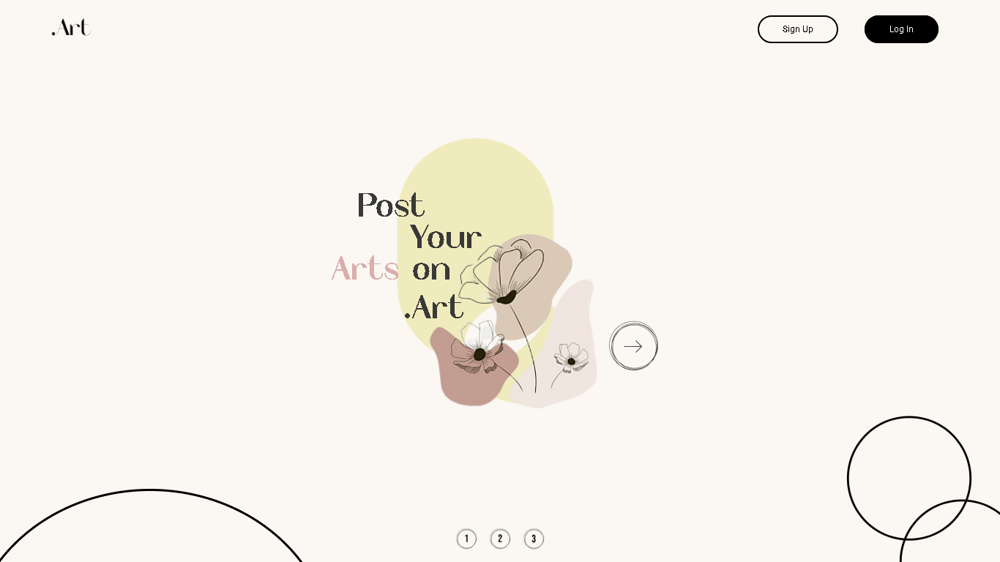
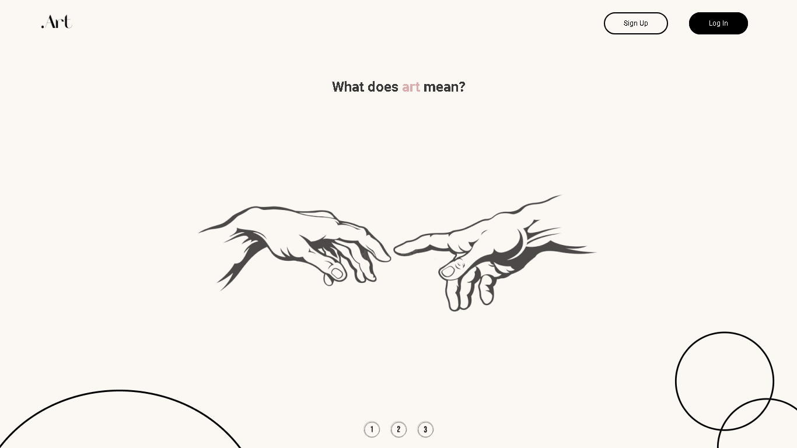

## 👀 Overview

Um slideshow criado apenas com CSS para uma página de boas-vindas para uma plataforma de arte.

<h3 align="center">Slide 1</h3>

<h3 align="center">Slide 2</h3>

<h3 align="center">Slide 3</h3>

  

## 💡 Ideia 

O projeto foi criado para mostrar algumas manipulações feitas com css, como modelo eu criei um página que imita um rede onde seriam postadas algumas artes, como o Dribbble ou o Behance, tenho uma pegada leve por isso eu utilizei cores pastéis, e mantive a seriedade da arte com a fonte. Como o objetivo deste projeto era apenas brincar e treinar com o css eu decidi não tornar este projeto responsivo.

 

## ⚙️ Tools

 - HTML
 - CSS

 
 

## 🚀 Future
  

### Código
Como esse projeto foi apenas para treinar CSS não pretendo fazer nada a mais neste projeto, porém ele foi de grande importância para aprender CSS e me deixar em como estou hoje.
 
 

 
 
 
<h3 align="center"> Criado com muito ❤️ por <a href="https://github.com/VBrianB"> Vinicius Brian Bolzani</a></h2>